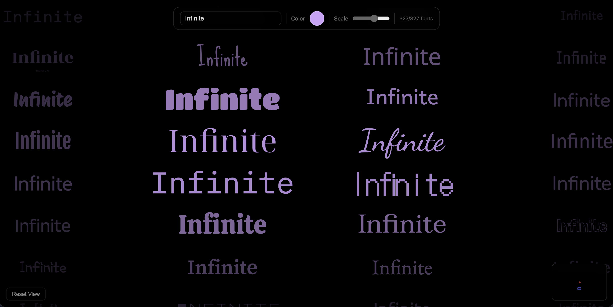

# InfiniteFonts

An infinite, scrollable canvas that displays your custom text rendered in 400+ Google Fonts simultaneously. Explore typography endlessly in every direction.





## Demo

**[Live Site](https://19avisconti.github.io/InfiniteFonts/)**

## Features

- **Infinite canvas** — scroll, drag, or pan in any direction forever
- **400+ Google Fonts** — every cell shows your text in a different typeface
- **Live customization** — change text, color, and scale in real time
- **Gaussian spotlight effect** — tiles near the center are bold and sharp; edges fade and shrink
- **Momentum scrolling** — flick to pan with natural deceleration
- **Minimap** — shows your current position relative to the origin
- **Auto background** — switches between dark/light mode based on text color contrast
- **Keyboard navigation** — Arrow keys or WASD to pan; Home to reset view

## Usage

Type any text into the toolbar input and watch it render across hundreds of fonts at once. Hover over a tile to see the font name.

| Control | Action |
|---|---|
| Click + Drag | Pan the canvas |
| Scroll wheel | Pan vertically/horizontally |
| Arrow keys / WASD | Pan the canvas |
| Home | Reset view to origin |
| Text input | Change the displayed text |
| Color picker | Change text color |
| Scale slider | Adjust font size |
| Reset View button | Return to origin |

## How It Works

- Fonts are loaded progressively in batches from the Google Fonts API
- Each grid cell is deterministically mapped to a font using a hash of its `(col, row)` coordinates, so the same font always appears at the same position
- Only tiles within the viewport (plus a small buffer) are rendered as DOM elements; off-screen tiles are removed
- A Gaussian falloff function controls opacity and scale based on each tile's distance from the viewport center

## Tech Stack

- Vanilla HTML, CSS, and JavaScript — no frameworks or build tools
- [Google Fonts](https://fonts.google.com/) for font delivery

## Local Development

No build step required. Just open `index.html` in a browser:

```bash
open index.html
```

Or serve it locally:

```bash
npx serve .
```
